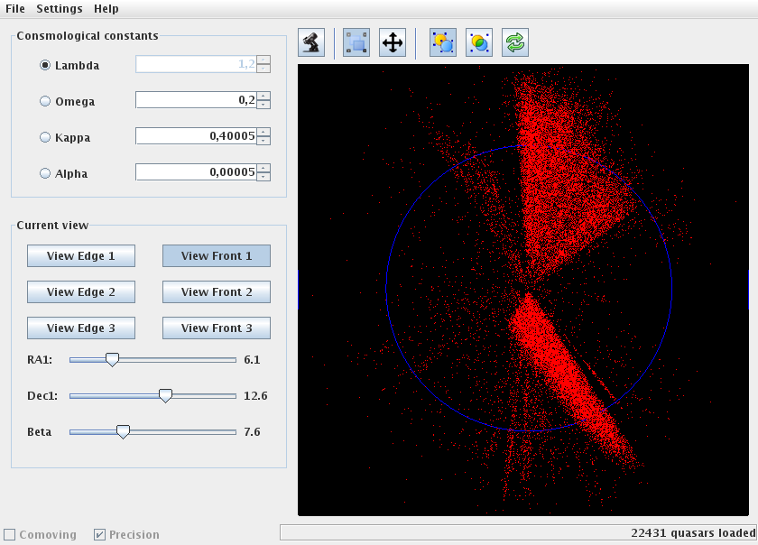

# Universe Viewer - Java legacy version

Interactive software for the visualization and geodesic analysis of high-redshift astronomical objects.\
It makes it possible to produce a conformal mapping of cosmological structures, particularly quasars, taking into account the curvature of the universe.

This is the legacy Java version, it is old and not maintained, please visit the new web-based version:
[from this GitHub repository](https://github.com/UniverseViewer/universe-viewer).

